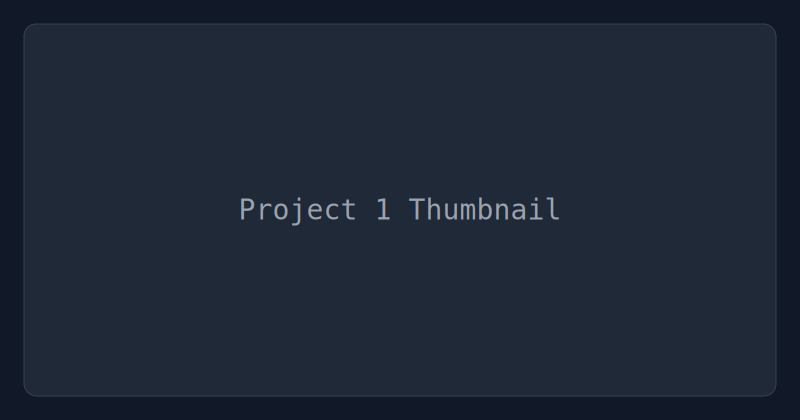
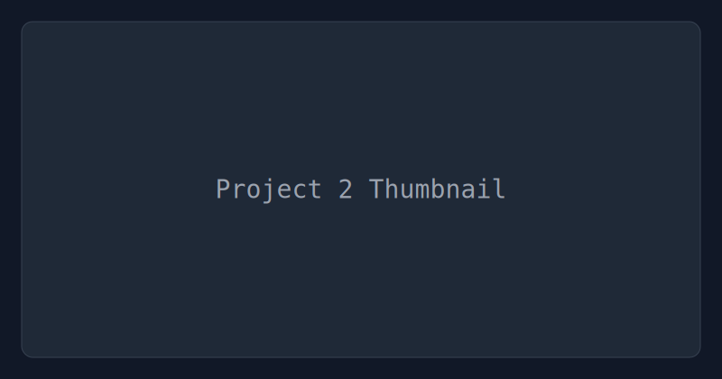

# Hi, I’m matthematics1137 👋

## About Me

- 🧮 Math + Code + Research.
- 🚀 Currently building: describe your current project(s).
- 🌱 Learning: list topics (e.g., Rust, CUDA, ML systems).
- 📫 Reach me: your email or preferred socials.

## Tech Stack

<!-- Add more shields as needed -->

<!-- Languages card removed by request -->

## Featured Projects

<table>
  <tr>
    <td width="50%">
      
       
      <b>Project 1</b>
       
      One sentence describing value/impact.
    </td>
    <td width="50%">
      
       
      <b>Project 2</b>
       
      One sentence describing value/impact.
    </td>
  </tr>
</table>

## Now

- 🔭 Focus: what you’re focused on now.
- ✍️ Writing: blog/newsletter if applicable.
- 🎯 Goals: short-term goals.

  
More: learning, tools, bookmarks

  - 📚 Learning path
  - 🧰 Favorite tools
  - 🔗 Useful links

## Connect

[-000000?logo=x&logoColor=white)](#)

<!-- Note: animations intentionally omitted. Add later if desired. -->
